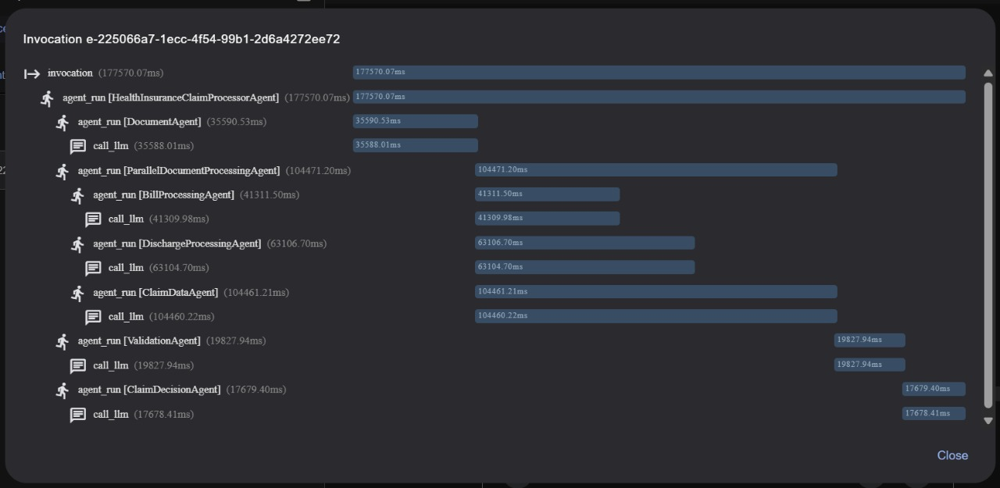
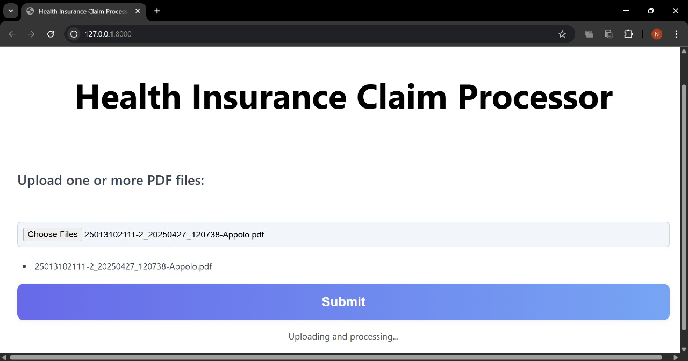
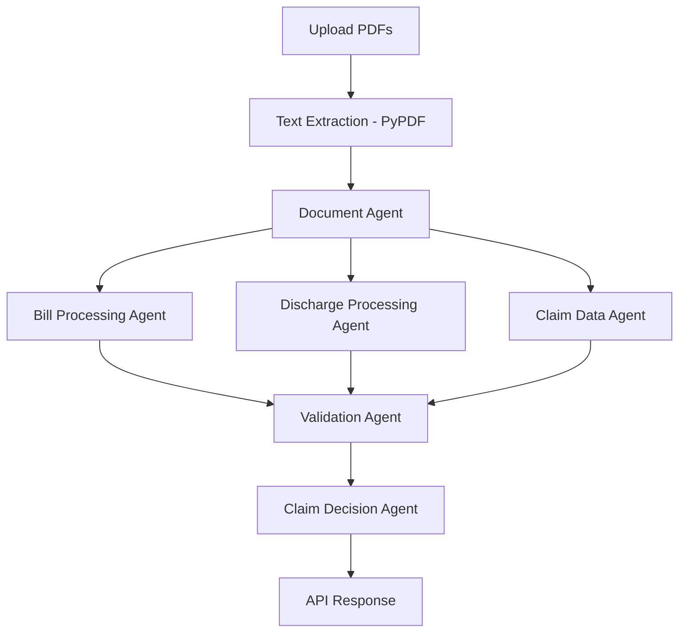

# Health Insurance Claim Processor

The Health Insurance Claim Processor is a full-stack solution for automating the extraction, classification, validation, and decision-making for medical insurance claim documents. It features a modern, dynamic web frontend (served at [http://localhost:8000/](http://localhost:8000/)) and a robust FastAPI backend with multi-agent orchestration. Designed for hospitals, TPAs, and insurance companies to streamline claim processing, reduce manual effort, and improve accuracy.

## Features

## Visual Assets & Example Outputs

### Agent Trace Visualization

**`agent-trace.jpeg`**

This image provides a visual trace of the agent workflow for a single claim processing request. It shows:

- The full invocation tree for the request, including all agent runs and LLM calls.
- The sequence and parallelism of agent execution:
  - The `HealthInsuranceClaimProcessorAgent` orchestrates the entire workflow.
  - The `DocumentAgent` runs first to classify documents.
  - The `ParallelDocumentProcessingAgent` then launches specialized agents in parallel:
    - `BillProcessingAgent`
    - `DischargeProcessingAgent`
    - `ClaimDataAgent`
  - Each of these agents calls the LLM and processes its respective document type.
  - After all parallel agents finish, the `ValidationAgent` runs to check for missing documents, inconsistencies, and data quality issues.
  - Finally, the `ClaimDecisionAgent` makes the final claim decision.
- The duration (in milliseconds) for each agent and LLM call, making it easy to identify bottlenecks or slow steps.

This trace is useful for debugging, performance analysis, and understanding the orchestration of the multi-agent pipeline.

**Example:**



---

### Frontend Homepage Screenshot

**`frontend-homepage.jpeg`**

This image shows the appearance of the web application's homepage. It demonstrates:

- The modern, clean UI for uploading one or more PDF files.
- The large, prominent heading "Health Insurance Claim Processor".
- The file input, file list, and submit button.
- Responsive design and visually appealing layout.

**Example:**



---

### Example Response Output (PDF)

**`frontend-testrun-response.pdf`**

This PDF is a printout screenshot of the actual response received on the frontend after uploading a test PDF. It shows:

- The structured JSON output as rendered by the frontend.
- The formatting and readability of the response display.
- Real data from a test run, demonstrating the end-to-end workflow.

This is useful for sharing results, documentation, or audits.

---

## System Overview & Agent Flow

The system processes uploaded PDFs (bills, discharge summaries, ID cards, claim forms, etc.) through a multi-agent pipeline:



**Step-by-step:**

1. **Upload**: User uploads one or more PDF files via the `/process-claim` endpoint or web UI.
2. **Text Extraction**: PyPDF extracts text from each PDF (no external OCR required).
3. **Document Classification**: An LLM agent classifies each document (bill, discharge, ID card, claim form, etc.).
4. **Parallel Agent Processing**: Specialized agents extract structured data from each document type:
    - **Bill Processing Agent**: Extracts billing details (amounts, hospital, patient, etc.)
    - **Discharge Processing Agent**: Extracts discharge summary details (diagnosis, dates, instructions, etc.)
    - **Claim Data Agent**: Extracts data from ID cards, correspondence, prescriptions, etc.
5. **Validation**: The validation agent checks for missing documents, inconsistencies, and data quality issues.
6. **Claim Decision**: The claim decision agent makes an automated approve/reject/pending decision with reasoning and confidence.
7. **Response**: The API returns a structured JSON with all agent outputs, validation, and decision.

## Quick Start

1. **Install dependencies:**

   ```bash
   uv sync
   ```

2. **Set up Ollama and pull a model:**
   - [Install Ollama](https://ollama.com/download) and start the service.
   - Pull a model (e.g., mistral):

     ```bash
     ollama pull mistral
     ```

   - Set `OLLAMA_MODEL` in your `.env` (e.g., `mistral:latest` or `llama3.2:3b`).
3. **Set up environment variables:**

   ```bash
   cp .env.example .env
   # Edit .env as needed
   ```

4. **Run the application:**

   ```bash
   uv run uvicorn main:app --host 0.0.0.0 --port 8000
   ```

5. **Open the frontend:**
   - Go to [http://localhost:8000/](http://localhost:8000/) in your browser.
   - Upload one or more PDF files and submit. The response tab will show extracted and validated claim data.
6. **(Optional) Test the API directly:**

   ```bash
   curl --max-time 1200 -X POST "http://127.0.0.1:8000/process-claim" \
     -H "Content-Type: multipart/form-data" \
     -F "files=@test_files/25013102111-2_20250427_120738-Appolo-ts.pdf"
   ```

## API Endpoints

### POST `/process-claim`

Process medical insurance claim documents (PDFs). Returns a structured JSON response with extracted data, validation, and claim decision.

**Request:**

- Content-Type: `multipart/form-data`
- Field: `files` (multiple PDF files)

**Response:**
See the detailed example and field explanations in the [Response Format Explained](#response-format-explained) section below. The response includes:

- `request_id`, `processing_time`, `timestamp`, `workflow_status`
- `agent_outputs` (with `documents`, `bill_data`, `discharge_data`, `claim_data`, `validation_results`, `claim_decision`)
- `raw_session_state` (for advanced debugging)

---

## Response Format Explained

The `/process-claim` endpoint returns a comprehensive JSON object with all extracted, validated, and decision data. The response is richer and more detailed when a full set of claim documents (bill, discharge summary, claim form, ID card, etc.) is provided.

**Response Fields:**

- `request_id`: Unique identifier for the claim processing request.
- `processing_time`: Time taken to process the request (seconds).
- `timestamp`: ISO timestamp when processing completed.
- `workflow_status`: `completed`, `no_outputs`, or `error`.
- `agent_outputs`:
  - `documents`: List of all classified documents, each with type, filename, extracted content, and confidence score.
  - `bill_data`: List of extracted bill details (hospital, patient, amounts, service details, etc.).
  - `discharge_data`: List of extracted discharge summary details (diagnosis, admission/discharge dates, procedures, etc.).
  - `claim_data`: List of extracted claim-related data (ID cards, correspondence, prescriptions, etc.).
  - `validation_results`: Validation summary (missing documents, discrepancies, validation score, recommendations, agent compliance issues).
  - `claim_decision`: Final decision (`approved`, `rejected`, or `pending`), reason, confidence score, and recommended actions.
- `raw_session_state`: (Advanced) Full agent state for debugging or audit.

**Note:**
Due to hardware limitations, the provided example output present in the  testrun.md file is the result of a test run on a single bill document 25013102111-2_20250427_120738-Appolo-ts.pdf with 17 pages. In production, when a large PDF or a full set of documents is uploaded, the response will be optimal and include:

- Multiple documents (bill, discharge summary, claim form, ID card, etc.)
- Complete extraction of all relevant fields from each document
- Detailed validation and cross-checking between documents
- A more confident and automated claim decision

**Example :**

```json
{
  "request_id": "a1b2c3d4-5678-90ef-ghij-klmnopqrstuv",
  "processing_time": 18.42,
  "timestamp": "2025-07-12T12:34:56.789Z",
  "workflow_status": "completed",
  "agent_outputs": {
    "documents": [
      { "type": "bill", "filename": "bill.pdf", "content": "...", "confidence": 0.98 },
      { "type": "discharge_summary", "filename": "discharge.pdf", "content": "...", "confidence": 0.97 },
      { "type": "claim_form", "filename": "claim_form.pdf", "content": "...", "confidence": 0.96 },
      { "type": "id_card", "filename": "id_card.pdf", "content": "...", "confidence": 0.99 }
    ],
    "bill_data": [
      {
        "hospital_name": "ABC Hospital",
        "total_amount": 12500,
        "date_of_service": "2024-04-10",
        "patient_name": "John Doe",
        "bill_number": "BILL12345",
        "insurance_amount": 10000,
        "patient_amount": 2500,
        "service_details": ["Surgery", "Room Charges", "Medicines"],
        "doctor_name": "Dr. Smith",
        "department": "Orthopedics"
      }
    ],
    "discharge_data": [
      {
        "patient_name": "John Doe",
        "admission_date": "2024-04-05",
        "discharge_date": "2024-04-10",
        "primary_diagnosis": "Fracture",
        "procedures_performed": ["Surgery"],
        "doctor_name": "Dr. Smith",
        "hospital_name": "ABC Hospital",
        "department": "Orthopedics"
      }
    ],
    "claim_data": [
      {
        "document_type": "id_card",
        "policy_number": "XYZ1234567",
        "member_id": "M123456",
        "insurance_company": "Best Insurance Co.",
        "coverage_type": "Family Floater"
      },
      {
        "document_type": "claim_form",
        "claim_number": "CLM987654",
        "date_filed": "2024-04-11"
      }
    ],
    "validation_results": {
      "missing_documents": [],
      "discrepancies": [],
      "validation_score": 100.0,
      "recommendations": [],
      "agent_compliance_issues": []
    },
    "claim_decision": {
      "status": "approved",
      "reason": "All required documents present and data is consistent.",
      "confidence_score": 98.5,
      "recommended_actions": []
    }
  },
  "raw_session_state": { ... }
}
```

---

## Error Handling & Troubleshooting

- If a timeout or error occurs, the response will have `workflow_status: "error"` and an `error` field with details.
- Check the `recommended_actions` field for next steps (e.g., retry, contact support).
- All errors are logged to the console and (optionally) to `app.log` if running with log file enabled.
- For debugging, inspect the `raw_session_state` field in the response.

**Example error response:**

```json
{
  "request_id": "...",
  "processing_time": 900.0,
  "timestamp": "...",
  "workflow_status": "error",
  "error": "timeout",
  "agent_outputs": null,
  "raw_session_state": null,
  "recommended_actions": ["Contact support"]
}
```

---

## Configuration & Environment Variables

All configuration is managed via `.env` and `utils/config.py`. Key settings:

- `OLLAMA_MODEL`: LLM model to use (e.g., `mistral:latest`, `llama3.2:3b`)
- `LOG_LEVEL`: Logging level (DEBUG, INFO, etc.)
- `MAX_FILE_SIZE`: Maximum PDF upload size (default: 10MB)
- `ALLOWED_EXTENSIONS`: Allowed file types (default: pdf)
- `AGENT_TIMEOUT`: Maximum time (seconds) for agent workflow (default: 900)

See `utils/config.py` for all options and defaults.

---

## Logs & Monitoring

- All major events, errors, and agent progress are logged to the console.
- To save logs to a file, run with:

  ```bash
  uvicorn main:app --host 0.0.0.0 --port 8000 --log-level info --log-file app.log
  ```

- Review logs with `less app.log` or any text editor.
- Log format and level can be customized in `.env` and `utils/logger.py`.

---

## FAQ

**Q: Can I use this with scanned images or only PDFs?**
A: Only PDFs are supported. For scanned images, convert them to PDF first. OCR is performed using PyPDF (text-based PDFs only).

**Q: What LLMs are supported?**
A: Any LLM supported by Ollama can be used directly (e.g., mistral, llama3). With minor code changes, you can use almost any LLM that is supported by liteLLM.

**Q: How do I increase the timeout for large claims?**
A: Set `AGENT_TIMEOUT` in your `.env` (default: 900 seconds).

**Q: How do I debug agent outputs?**
A: Inspect the `raw_session_state` field in the API response for full agent state.

**Q: How do I add new document types or agents?**
A: Extend the agent classes in `agents/HealthInsuranceClaimProcessorAgent/sub_agents/` and update the workflow in `workflow_agent.py`.

---

**Key Technologies:**

- FastAPI (REST API)
- Google ADK (agent orchestration)
- Ollama (local LLMs, e.g., mistral, llama3)
- PyPDF (PDF parsing and text extraction)

### Docker Deployment

Build and run the application in a containerized environment:

```bash
# Build the Docker image
docker build -t health-claim-processor .

# Run the container (default: port 8000)
docker run --rm -p 8000:8000 \
  -e OLLAMA_MODEL=mistral:latest \
  -e LOG_LEVEL=INFO \
  health-claim-processor
```

**Notes:**

- The container runs as a non-root user for security.
- All environment variables in `.env` can be overridden with `-e` flags at runtime.
- The default entrypoint uses `uv` and `uvicorn` for robust FastAPI serving.
- For production, use a process manager or container orchestration for resilience.

## Project Structure

```
├── agents/                         # All agent logic and orchestration
│   └── HealthInsuranceClaimProcessorAgent/
│       ├── agent.py                # Main agent entrypoint
│       ├── workflow_agent.py       # Orchestrates the agent workflow
│       └── sub_agents/             # Specialized sub-agents for each document type
│           ├── BillProcessingAgent/bill_agent.py           # Bill extraction logic
│           ├── ClaimDataAgent/claim_data_agent.py          # ID card, correspondence, prescription extraction
│           ├── ClaimDecisionAgent/claim_decision_agent.py  # Final claim decision logic
│           ├── DischargeProcessingAgent/discharge_agent.py # Discharge summary extraction
│           ├── DocumentAgent/document_agent.py             # Document classification logic
│           └── ValidationAgent/validation_agent.py         # Data validation logic
├── frontend/                      # Web frontend (UI)
│   ├── index.html                 # Main UI
│   ├── style.css                  # Stylesheet
│   └── app.js                     # Frontend logic
├── main.py                        # FastAPI app entrypoint
├── services/                      # Service layer for business logic
│   ├── claim_processor.py         # Main claim processing service
│   └── pdf_processor.py           # PDF text extraction service
├── utils/                         # Utility modules
│   ├── config.py                  # Configuration management
│   └── logger.py                  # Logging setup
├── test_files/                    # Example/test PDFs
├── Dockerfile                     # Docker build instructions
├── pyproject.toml                 # Python project metadata & dependencies
├── uv.lock                        # Locked dependency versions
├── .env                           # Environment variables (user config)
├── .env.debug                     # Debug environment variables
├── README.md                      # Project documentation
├── .gitignore                     # Git ignore rules
```

**Other files:**

- `extracted_text_from_pdf_used_for_testrun.txt`: the text extracted from the test PDF.
- `testrun.md`: output of the API request and response for the test run.

Each file/folder is commented above for its purpose in the project.

## License

MIT License

## Maintainer

Nihaal Anupoju  
<nihaal.a084@gmail.com>
